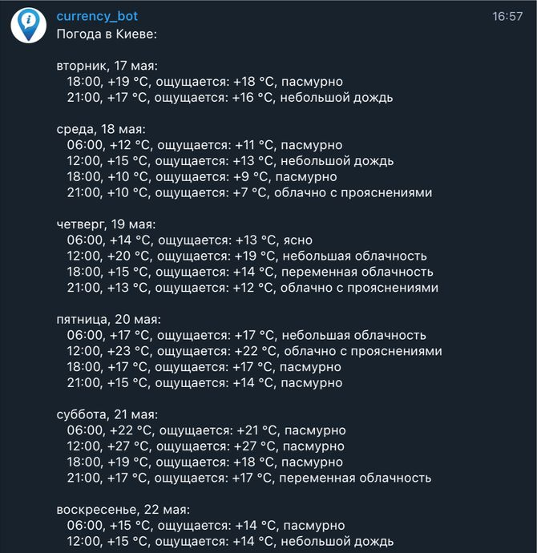

# 5. **Telegram w**eather forecast

Bot provides the weather forecast for a specific city. You can choose any city based on your preference or location;

**Requirements:**

- Provide weather forecasts for every 3 or 6 hours upon the user's request
- The menu structure should be presented with buttons as follows:
    - "Weather forecast in {{city}}"
    - "With a 3-hour interval" / "With a 6-hour interval"
- The bot should work continuously, not just when you start the server. To achieve this, use any hosting service. The free version there is sufficient for this purpose.

⚠️ Use [weather api](https://openweathermap.org/api)  and [node-telegram-bot-api](https://www.npmjs.com/package/node-telegram-bot-api)

Technically and visually, the result must correspond to the example

Use node index.js to start the program.